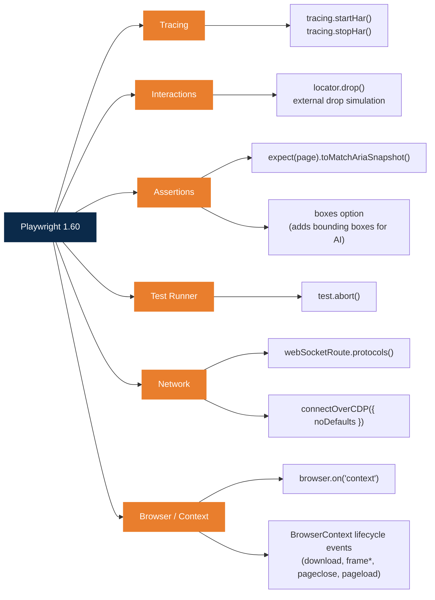
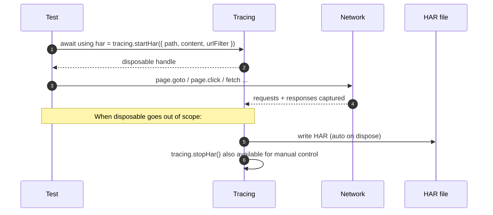
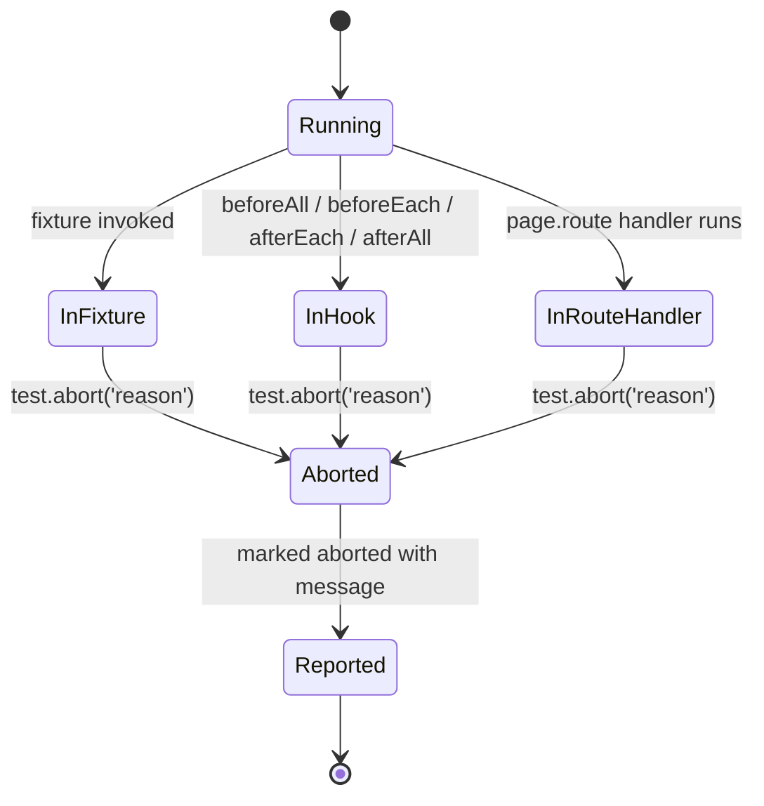
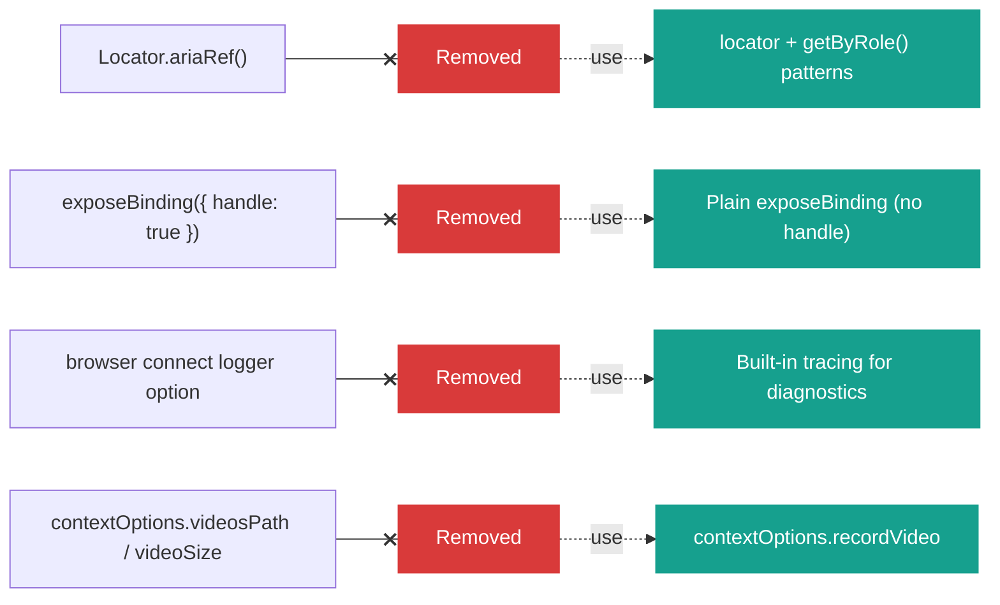

# Playwright 1.60 — Release Notes

Source: https://playwright.dev/docs/release-notes

## What's New at a Glance

---

## Major Features

### HAR Recording on Tracing

`tracing.startHar()` and `tracing.stopHar()` are now first-class APIs. They expose the same `content`, `mode`, and `urlFilter` options as `recordHar`, and return a disposable for scope management using `await using` syntax.

**Flow:**

### Drop API

A new `locator.drop()` method simulates an external drag-and-drop of files or clipboard-like data onto an element. It supports both file uploads and clipboard data, with cross-browser compatibility.

### Aria Snapshots Expansion

- `expect(page).toMatchAriaSnapshot()` now works on `Page` objects, not just `Locator` objects.
- A new `boxes` option appends each element's bounding box as `[box=x,y,width,height]` — useful for AI processing.

### Test Abort Functionality

The new `test.abort()` method aborts the currently running test from a fixture, hook, or route handler, with an optional message.

**Where you can call it from:**

Use it when an external precondition fails (e.g. a stub service is down) and you want to mark the test aborted — not failed — without throwing your own error.

---

## New APIs

### Browser, Context & Page
- `browser.on('context')` event fires when a context is created.
- `BrowserContext` now mirrors page lifecycle events: `download`, `frameattached`, `framedetached`, `framenavigated`, `pageclose`, `pageload`.

### Locators & Assertions
- `description` option in `getByRole()` methods for accessible description matching.
- `pseudo` option in `toHaveCSS()` for reading `::before` and `::after` styles.
- `style` option in `locator.highlight()` for custom overlay CSS.

### Network
- `webSocketRoute.protocols()` returns requested WebSocket subprotocols.
- `noDefaults` option in `connectOverCDP()` disables Playwright's default context overrides.

### Errors & Reporting
- `webError.location()` mirrors console message location properties.
- `consoleMessage.location()` exposes `line` / `column` properties.
- `testInfoError.errorContext` surfaces diagnostic information.
- `reporter.onError()` receives `workerInfo` for worker-related errors.

### Test Runner
- `{testFileBaseName}` token in snapshot path templates.
- Error handling for non-option fixture overrides and invalid worker counts.

---

## Browser Versions

| Browser | Version |
| --- | --- |
| Chromium | 148.0.7778.96 |
| Mozilla Firefox | 150.0.2 |
| WebKit | 26.4 |

---

## Breaking Changes — Migration

The following deprecated APIs were removed. Use the replacements below:

| Removed | Replace with |
| --- | --- |
| `Locator.ariaRef()` | `locator` + `getByRole()` patterns |
| `handle` option on `exposeBinding` | plain `exposeBinding` (no handle) |
| `logger` option on browser connect | built-in tracing |
| `contextOptions.videosPath` / `videoSize` | `contextOptions.recordVideo` |
